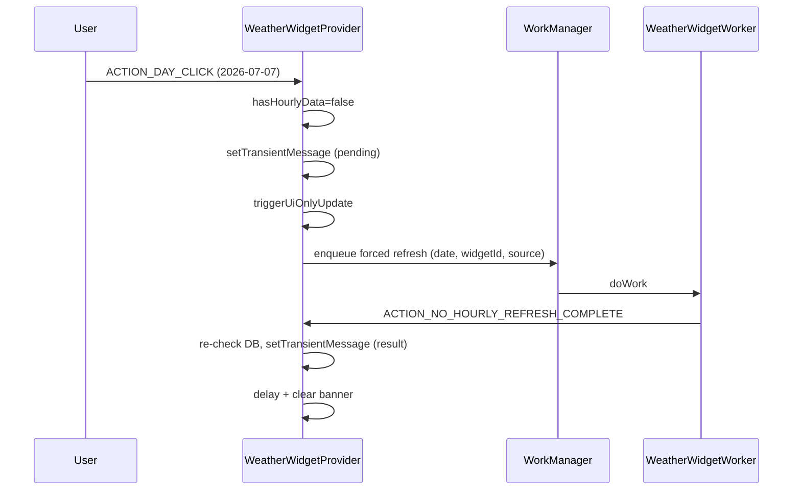

# Two-Phase Missing-Hourly Day Click

## Problem

Today, tapping a future day with no hourly data (e.g. **Tue Jul 7** on NWS) shows a **single** banner already framed as "Results of refresh:" **before** the network fetch finishes (`WeatherWidgetProvider.navigateToHourlyView`). Desired behavior:

1. **Immediate** message: data missing for the tapped day; a refresh will be triggered
2. **Scoped refresh** for that day (active source, horizon through the tapped date)
3. **After refresh completes**: a second message reporting the actual outcome
4. **Robolectric tests** covering the above

On success, show the result message only (no auto-navigation to hourly graph).

## Architecture

Provider phase 1 returns quickly; worker fetches; worker broadcasts completion; provider phase 2 shows result and clears after ~8s.



## Files

- `NoHourlyDayClickCoordinator.kt` — message builders + shared DB queries
- `WeatherWidgetProvider.kt` — phase 1 + completion handler
- `WeatherWidgetWorker.kt` — scoped fetch + completion broadcast
- `WidgetActions.kt` — `ACTION_NO_HOURLY_REFRESH_COMPLETE`
- `strings.xml` — pending/result templates
- `WeatherWidgetProviderNoHourlyRoboTest.kt`, `NoHourlyDayClickCoordinatorTest.kt`
- `DailyFutureDayNoHourlyClickIntegrationTest.kt`

## Verification

```bash
./gradlew :app:test --tests "com.weatherwidget.widget.WeatherWidgetProviderNoHourlyRoboTest"
./gradlew :app:test --tests "com.weatherwidget.widget.handlers.NoHourlyDayClickCoordinatorTest"
./scripts/emulator-tests.sh -c com.weatherwidget.widget.handlers.DailyFutureDayNoHourlyClickIntegrationTest
```