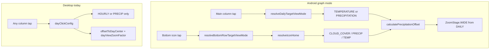

# Desktop/Android Daily Day-Click Parity

## Overview

Align desktop daily day-click behavior with Android graph mode: split main-column vs bottom-icon taps, shared routing/offset logic in `:shared`, and WIDE zoom when entering hourly view from daily. Ignore Android 1-row text mode; desktop text clicks stay as main-column taps.

## Current gaps (evidence-backed)

Samsung logs for **2026-07-07** already show Android working as designed:

```
CLICK_DAILY: targetView=TEMPERATURE, offset=145, clickSource=graph_day:col=8:date=2026-07-07
HOURLY_DAY_EXTREMA: span=2026-07-07T00:00..2026-07-08T00:00
```

Desktop diverges in three ways:

| Behavior | Android (graph mode) | Desktop today |
|----------|---------------------|---------------|
| **Main column tap** | `TEMPERATURE` (or `PRECIPITATION` if rain icon + precip ≥ 16%) | `HOURLY` — routing already matches via `WeatherConditionResolver.resolveDailyClickHome` |
| **Bottom icon tap** | `CLOUD_COVER` for cloud-eligible icons via `DayClickHelper.resolveBottomRowTargetViewMode` | **Not implemented** — `DailyForecastGraph` has one `onDayClick` for the whole column |
| **Offset + zoom** | `calculatePrecipitationOffset` (noon anchor) + `ZoomStage.WIDE` when entering from daily (`WidgetIntentRouter.handleSetView` L618–625) | `offsetToDayCenter` (midnight-left-edge) + `dayViewZoomFactor` (~0.337) |



## Target behavior (desktop graph mode)

Mirror Android graph-mode split:

1. **Tap above the icon band** (main column) → hourly **temperature** (`ViewMode.HOURLY`), unless rain icon + precip ≥ 16% → **precipitation**.
2. **Tap the bottom icon band** (icon + low-label row, matching Android’s 140dp `graph_bottom_day_zones`) → route via `WeatherConditionResolver.resolveIconHome` → **cloud cover** for cloudy/mostly-clear icons.
3. **Offset**: shared noon-anchor offset (same formula that produced `offset=145` for Jul 7 on Samsung).
4. **Zoom**: `DesktopGraphUtils.zoomFactorForStage(ZoomStage.WIDE)` (~0.304, 12h+12h) when transitioning from `DAILY`, matching Android’s `handleSetView` reset — not `dayViewZoomFactor`.

**Text mode (desktop only):** keep whole-column click; always use **main-column** routing (ignore Android 1-row text mode).

## Shared code extraction (`:shared`)

Add `shared/src/main/kotlin/com/weatherwidget/shared/util/DayClickResolver.kt`:

```kotlin
enum class DayTapZone { MAIN_COLUMN, BOTTOM_ICON }
enum class DayClickView { TEMPERATURE, PRECIPITATION, CLOUD_COVER }

fun resolveView(zone: DayTapZone, iconName: String?, precipProbability: Int?): DayClickView
fun calculateHourlyOffset(now: LocalDateTime, targetDay: LocalDate): Int
```

Implementation consolidates logic now split across:

- `DayClickHelper.resolveDailyTargetViewMode` + `WeatherConditionResolver.resolveDailyClickHome`
- `DayClickHelper.resolveBottomRowTargetViewMode` + `WeatherConditionResolver.resolveIconHome`
- `DayClickHelper.calculatePrecipitationOffset`

Move **`alignToNearestHourHalfUp`** to `shared/src/main/kotlin/com/weatherwidget/shared/util/WeatherTimeUtils.kt` (pure JVM only). Android `WeatherTimeUtils` keeps Android-specific helpers (`getCurrentHourForecast`) and delegates hour alignment to shared.

Add `shared/src/test/kotlin/com/weatherwidget/shared/util/DayClickResolverTest.kt` by porting the routing and offset cases from `DayClickHelperTest` (including the “noon offset + 12h back = midnight window” invariant).

**Leave on Android only:** `calculateNightCenterOffset` (needs `SunPositionUtils`), `hasRainForecast` (display), `resolveHourlyBottomRowAction` (hourly-graph bottom strip — out of scope).

## Android refactor (thin wrappers)

`DayClickHelper` becomes a facade:

- `resolveDailyTargetViewMode` → `DayClickResolver.resolveView(MAIN_COLUMN, …)` mapped to `ViewMode`
- `resolveBottomRowTargetViewMode` → `DayClickResolver.resolveView(BOTTOM_ICON, …)` mapped to `ViewMode`
- `calculatePrecipitationOffset` → `DayClickResolver.calculateHourlyOffset`

Existing Android unit/integration tests should pass unchanged (`DailyMainColumnVsBottomIconClickTargetIntegrationTest`, `DayClickHelperTest`).

## Desktop changes

### 1. Split hit testing in `DailyForecastGraph.kt`

Replace single `onDayClick: (LocalDate) -> Unit` with:

```kotlin
onDayClick: (date: LocalDate, zone: DayTapZone) -> Unit
```

In `detectTapGestures`, classify tap Y against a bottom strip height matching Android layout proportions (`bottomReserve` already computed ~ icon + low label + day label; use `size.height - bottomReserve` as the split, aligned with Android’s `marginBottom=140dp` on `graph_day_zones`).

### 2. Rewrite `dayClickConfig` in `Main.kt`

```kotlin
internal fun dayClickConfig(
    config: DesktopConfig,
    clickedDate: LocalDate,
    days: List<DesktopDailyDay>,
    zone: DayTapZone,
    now: LocalDateTime = LocalDateTime.now(),
): DesktopConfig
```

- Resolve view via `DayClickResolver.resolveView(zone, iconName, precipProb)` → map `TEMPERATURE`→`ViewMode.HOURLY`, etc.
- `hourlyOffset = DayClickResolver.calculateHourlyOffset(now, clickedDate)`
- `zoomFactor = DesktopGraphUtils.zoomFactorForStage(ZoomStage.WIDE)` (only when `config.viewMode == ViewMode.DAILY`; preserve zoom when switching hourly graph types mid-session, matching Android `handleSetView`)
- Delete `offsetToDayCenter` (no longer needed)

Update `handleDayClick` in `Main.kt` to pass `DayTapZone.MAIN_COLUMN` from text mode and the zone from graph mode.

### 3. Tests

Update/add in `desktop/src/test/kotlin/com/weatherwidget/desktop/DesktopUiTest.kt`:

- `testDayClickOpensFullDayWindow` — assert WIDE zoom + shared offset yields midnight→midnight window (port Android’s offset+12h-back invariant)
- `testDayClickRoutesLikeAndroid` — extend with **bottom-icon cloudy → CLOUD_COVER**
- New graph hit-zone test (unit-level helper or Compose test): tap Y above/below split selects correct zone

Keep `DesktopNoHourlyDayClickTest` passing (no-hourly two-phase flow already shares `NoHourlyChecker`).

## Verification

After implementation:

1. `./gradlew :shared:test :app:test --tests '*DayClickHelperTest*' :desktop:test --tests '*DesktopUiTest*'`
2. Manual desktop: click Jul 7 main column → hourly temp at ~offset 145h; click bottom icon on cloudy day → cloud cover
3. Optional Samsung regression: tap Jul 7 again and confirm `CLICK_DAILY` log unchanged

## Files touched (summary)

| File | Change |
|------|--------|
| `shared/.../DayClickResolver.kt` | **New** — shared routing + offset |
| `shared/.../WeatherTimeUtils.kt` | **New** — `alignToNearestHourHalfUp` |
| `shared/.../DayClickResolverTest.kt` | **New** |
| `app/.../DayClickHelper.kt` | Delegate to shared |
| `app/.../WeatherTimeUtils.kt` | Delegate hour alignment to shared |
| `desktop/.../DailyForecastGraph.kt` | Split tap zones |
| `desktop/.../Main.kt` | `dayClickConfig` uses shared resolver + WIDE zoom |
| `desktop/.../DesktopUiTest.kt` | Updated + new routing/hit-zone tests |

## Implementation todos

1. Add `DayClickResolver` + shared `WeatherTimeUtils.alignToNearestHourHalfUp` with unit tests ported from `DayClickHelperTest`
2. Refactor `DayClickHelper` to delegate to `DayClickResolver`; verify existing Android tests pass
3. Split `DailyForecastGraph` tap hit zones (main column vs bottom icon band) and plumb `DayTapZone` through `Main.kt`
4. Rewrite `dayClickConfig`: shared routing/offset, `ZoomStage.WIDE` from DAILY, remove `offsetToDayCenter`
5. Update `DesktopUiTest` for WIDE zoom, shared offset window, and bottom-icon → CLOUD_COVER routing