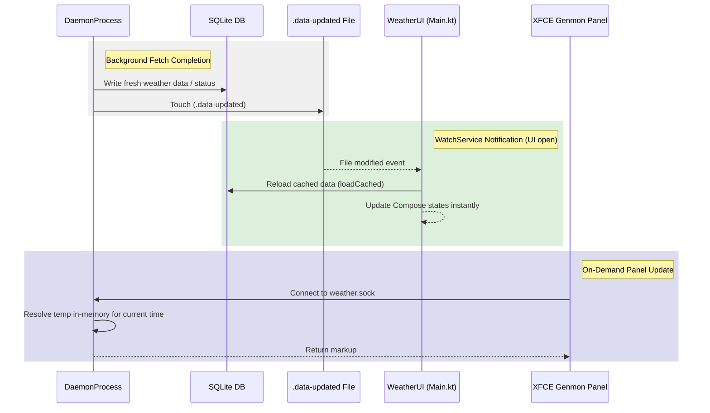

# Plan: Interrupt-Driven & Message-Driven Desktop UI Updates

## 1. Context & Motivation
Currently, both the headless background process (`DaemonProcess.kt`) and the ephemeral UI process (`Main.kt`) rely on periodic polling loops to keep the weather data and user interface fresh:
- `Main.kt` runs a loop every 2 minutes (`CURRENT_TEMP_UI_INTERVAL_MS`) to read the SQLite database cache via `repo.loadCached()`.
- `Main.kt` runs another loop every 2 minutes to poll the database for failed fetch status via `weatherDao.getLatestCurrentTempStatus()`.
- `DaemonProcess.kt` runs a 2-minute loop to load cached data from the database to update the `forecastState` and refresh the XFCE Genmon panel markup.

This design has several drawbacks:
1. **Inefficient I/O & CPU**: Constant disk reads and SQLite queries occur 24/7 in the daemon, even when weather observations only change every 10–30 minutes, and forecast queries only change every 1–4 hours.
2. **Update Latency**: The UI process can take up to 2 minutes to display fresh data fetched by the background daemon.
3. **Resource Waste**: Running database loops for static data is not battery- or CPU-friendly.

We will transition the desktop module to an **interrupt-driven** (for database changes) and **message-driven/on-demand** (for time-based temperature interpolation) architecture.

---

## 2. Proposed Architecture



### Key Components

1. **`.data-updated` Trigger File**:
   - A hidden trigger file `.data-updated` in `appDataDir()` is used as the cross-process event channel.
   - Any process writing fresh forecast data, observations, or fetch status updates to SQLite will touch `.data-updated`.

2. **UI Process File-Watching**:
   - The UI process's existing `WatchService` loop (which already monitors `.ui-show`) will also watch for `.data-updated`.
   - When `.data-updated` is modified, the UI immediately reloads the cache and updates its error status banner. This eliminates periodic database polling.

3. **In-Memory Current Temp Resolution**:
   - As time advances, the interpolated current temperature must update. However, this is a pure function of `time`, `hourly forecasts`, and `observations`—which are completely static until the next background fetch.
   - We will extract a public, in-memory resolver function `resolveCurrentTempInMemory(forecast: ForecastResult, now: Long)` in `DesktopWeatherRepository.kt`.
   - The UI process will run a local ticker that updates a `now` Compose state (or triggers a recomposition) every minute to update the current temp in-memory with **zero database/disk I/O**.

4. **On-Demand Socket Resolution**:
   - The XFCE Genmon panel updates itself by calling the Unix socket `weather.sock`.
   - Instead of the daemon running a 2-minute loop to continuously generate panel markup in the background, the socket handler (`PanelIpcServer.kt`) will resolve the temperature and format the Pango markup **on-demand** when a socket connection is accepted.

---

## 3. Detailed Implementation Changes

### A. Define the Trigger File
In [DesktopProcess.kt](file:///home/dcar/projects/weather-widget/desktop/src/main/kotlin/com/weatherwidget/desktop/DesktopProcess.kt), add the constant:
```kotlin
const val DATA_UPDATED_TRIGGER = ".data-updated"
```

Also, define a helper function to touch this trigger file:
```kotlin
fun notifyDataUpdated() {
    runCatching {
        val trigger = appDataDir().resolve(DATA_UPDATED_TRIGGER)
        Files.writeString(trigger, "", java.nio.charset.StandardCharsets.UTF_8)
    }
}
```

### B. Extract In-Memory Resolution
In [DesktopWeatherRepository.kt](file:///home/dcar/projects/weather-widget/desktop/src/main/kotlin/com/weatherwidget/desktop/DesktopWeatherRepository.kt), refactor the private helper `resolveForForecastResult` so it does not perform database queries directly. Instead, extract a pure function that accepts a list of observations:

```kotlin
private fun resolveForForecastResult(
    hourly: List<HourlyForecast>,
    observations: List<com.weatherwidget.data.model.ObservationReading>,
    now: Long
): Pair<Float?, Float?> {
    // Current resolution logic using the passed list of observations...
}
```

Implement a public in-memory resolver method:
```kotlin
fun resolveCurrentTempInMemory(forecast: ForecastResult, now: Long): Pair<Float?, Float?> {
    val displaySource = WeatherSource.fromDisplaySource(weatherSource)
    val nowLocal = LocalDateTime.ofInstant(Instant.ofEpochMilli(now), ZoneId.systemDefault())
    
    val window = CurrentTemperatureResolver.buildCurrentTempResolutionWindow(nowLocal)
    val zoneId = ZoneId.systemDefault()
    val minEpoch = window.start.atZone(zoneId).toInstant().toEpochMilli()
    val maxEpoch = window.end.atZone(zoneId).toInstant().toEpochMilli()

    val narrowObs = forecast.rawObservations.filter { it.timestamp in minEpoch..maxEpoch }
    val narrowHourly = forecast.hourly.filter { it.dateTime in minEpoch..maxEpoch }

    // Run resolution using the narrow slices
    ...
}
```

### C. Update Daemon Process (`DaemonProcess.kt`)
1. **Trigger on Fetch Completion**:
   - In `runLaunchRefresh`, observations loop, and forecast loops, call `notifyDataUpdated()` whenever a fetch succeeds or fail-status is updated.
2. **Remove Current-Temp UI Loop**:
   - Delete the loop starting at line 312: `while (true) { delay(CURRENT_TEMP_UI_INTERVAL_MS) ... }`.
3. **Listen for Changes**:
   - In the `WatchService` loop of `DaemonProcess.kt`, handle `DATA_UPDATED_TRIGGER`:
     ```kotlin
     DATA_UPDATED_TRIGGER -> {
         runCatching { Files.deleteIfExists(appDir.resolve(DATA_UPDATED_TRIGGER)) }
         val cached = repo?.loadCached()
         if (cached != null) {
             forecastState.value = cached
             val lastFetch = weatherDao.getLastSuccessfulFetch(config.weatherSource)
             dataStatusState.value = DataStatus.Live(lastFetch ?: System.currentTimeMillis())
         }
     }
     ```
4. **On-Demand Socket Markup**:
   - Modify `PanelIpcServer` to accept a provider/callback for the latest in-memory data (forecast, status, config) and dynamically resolve the temperature for the current timestamp `System.currentTimeMillis()` at the moment of connection.

### D. Update UI Process (`Main.kt`)
1. **Remove Polling Loops**:
   - Delete the cache loading loop (lines 327–336).
   - Delete the status banner loop (lines 436–440).
2. **Extend File-Watching**:
   - Update the `WatchService` loop (lines 466–496) to also watch for `DATA_UPDATED_TRIGGER`:
     ```kotlin
     if (name == DATA_UPDATED_TRIGGER) {
         runCatching { java.nio.file.Files.deleteIfExists(dir.resolve(DATA_UPDATED_TRIGGER)) }
         SwingUtilities.invokeLater {
             // Trigger cache reload and status update
             uiScope.launch {
                 val cached = repo.loadCached()
                 if (cached != null) forecast = cached
                 updateStatus()
                 logBannerTransition()
             }
         }
     }
     ```
3. **Time-Driven Local Interpolation Ticker**:
   - Create a local minute-aligned coroutine ticker to update a Compose state `nowMs`:
     ```kotlin
     var nowMs by remember { mutableStateOf(System.currentTimeMillis()) }
     LaunchedEffect(Unit) {
         while (true) {
             delay(60_000L - (System.currentTimeMillis() % 60_000L))
             nowMs = System.currentTimeMillis()
         }
     }
     ```
   - Dynamically compute `displayTemp` and `deltaTemp` using the extracted `resolveCurrentTempInMemory(forecast, nowMs)` method instead of reading `forecast.currentTemp` statically.
4. **Network Warmup Grace Window Expiration**:
   - If `updateStatus()` determines that the error is currently suppressed by the network warmup grace window, calculate the remaining time until the grace window expires:
     `val timeRemaining = lastWakeEventMs + graceMs - nowMs`
   - Launch a single target coroutine `delay(timeRemaining)` and call `updateStatus()` again once the grace period ends. This transitions to the hard error banner exactly on time with zero polling.

---

## 4. Verification Plan

### Automated Verification
1. **Unit Tests**:
   - Add unit tests for the extracted `resolveCurrentTempInMemory` method in `DesktopWeatherRepositoryTest.kt` to ensure it resolves the exact same temperature values as the DB-backed version.
2. **Verify Tests Pass**:
   - Execute all unit tests using `./gradlew :desktop:test`.

### Manual & Interactive Verification
1. **Log Audit**:
   - Audit the application logs using `sqlite3` or the App Logs window to ensure database queries and `loadCached` executions only happen on startup, manual refreshes, and background fetch completions.
2. **Genmon Panel Testing**:
   - Verify the XFCE Genmon panel updates its temperature correctly when the clock ticks and when fetches occur.
3. **Real-time UI Responsiveness**:
   - Run the UI and perform a manual refresh. Verify that the daemon and UI update instantly.
