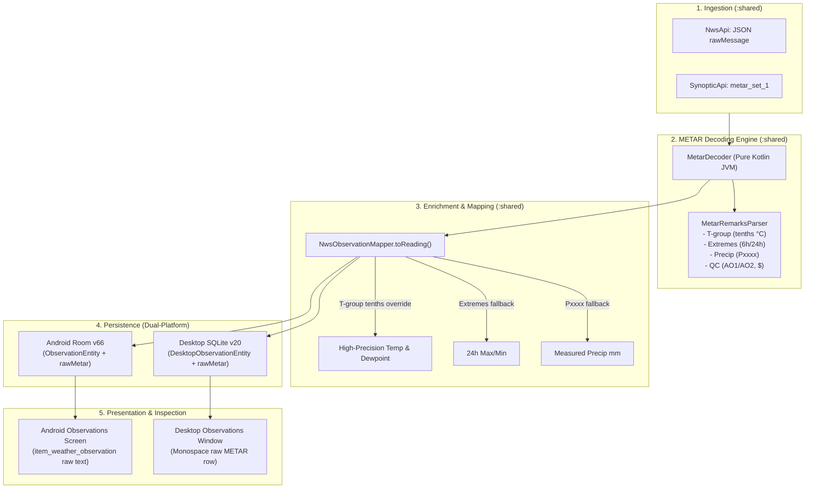

# Implementation Plan — METAR Cluster A (Precision Decoding & Raw Storage)

**Date:** 2026-08-23  
**Status:** PROPOSED — Awaiting User Approval  
**Target Modules:** `:shared` (decoder, mapper, models, desktop DB), `:app` (Room v66, Android UI), `:desktop` (Compose UI)  

---

## 1. Goal & Scope

Cluster A focuses on **fully parsing and exploiting the METAR data already arriving** in existing NWS and Synoptic network responses without introducing new network endpoints.

### Key Objectives
1. **Sub-Degree Precision (`T-group`)**: Parse the `T[s][TTT][s][DDD]` remark into exact tenth-of-a-degree Celsius (converted to °F), eliminating the $\pm 0.9^\circ\text{F}$ integer truncation noise from `api.weather.gov`.
2. **Official Extremes (`1sTTTT`, `2sTTTT`, `4sTTTTsTTTT`)**: Extract 6-hour and 24-hour sensor extremes from remarks.
3. **Measured Hourly Precipitation (`Pxxxx`, `6xxxx`, `7xxxx`)**: Extract hundredths-of-an-inch rainfall accumulation.
4. **Present Weather & Station QC (`AO1`/`AO2`, `$`, `+TSRA`, `-RA`, etc.)**: Decode sensor diagnostics and weather conditions.
5. **Raw METAR Debug Column**: Add `rawMetar TEXT` to both Android Room (`observations` table) and Desktop SQLite schemas so raw payloads are preserved for debugging, UI inspection, and re-parsing.

---

## 2. Architecture & Design



---

## 3. Detailed Component Changes

### Component 1: Pure-Function METAR Decoder (`:shared`)
* **Location:** `shared/src/main/kotlin/com/weatherwidget/shared/observations/`
* **Classes:**
  * `MetarDecoder`: Decodes standard METAR / SPECI body tokens (station, time, wind, visibility, weather, clouds, body temp/dewpoint, altimeter) and delegates remarks to `MetarRemarksParser`.
  * `MetarRemarksParser`:
    * `T-group`: `Regex("""\bT([01])(\d{3})([01])(\d{3})\b""")`  
      $\text{Sign } 0 \to +, 1 \to -$. Example `T02000144` $\to +20.0^\circ\text{C} / +14.4^\circ\text{C}$.
    * `6h Max/Min`: `1([01])(\d{3})` (Max), `2([01])(\d{3})` (Min).
    * `24h Max/Min`: `4([01])(\d{3})([01])(\d{3})`.
    * `Precipitation`: `P(\d{4})` (hourly $0.01\text{ in} \to \text{mm}$), `6(\d{4})` (3/6-hr), `7(\d{4})` (24-hr).
    * `QC & Maintenance`: Detects `AO1`, `AO2`, `$` (maintenance flag).
    * `Sea Level Pressure`: `SLP(\d{3})` $\to \text{hPa}$.

### Component 2: Ingestion & Enrichment Pipeline (`:shared`)
* **`NwsApi.kt`**:
  * `Observation` data class: add `val rawMessage: String? = null`.
  * `parseObservationProperties`: populate `rawMessage = props["rawMessage"]?.jsonPrimitive?.contentOrNull`.
* **`SynopticApi.kt`**:
  * `Observation` data class instantiation: pass `rawMessage = rawMetar` from `metar_set_1`.
* **`NwsObservationMapper.kt`**:
  * Decode `observation.rawMessage` using `MetarDecoder`.
  * **Temperature**: If `remarks.preciseTempCelsius != null`, compute `celsiusToFahrenheit(remarks.preciseTempCelsius)` to provide exact tenth-degree Fahrenheit instead of integer-truncated values.
  * **Extremes**: If `maxTempLast24hCelsius` / `minTempLast24hCelsius` are null, populate from remarks 24h extreme group `4sTTTTsTTTT`.
  * **Precipitation**: If `precipLastHourMm` is null, populate from remarks hourly precip `Pxxxx`.
  * Store `rawMetar = observation.rawMessage` in `ObservationReading`.

### Component 3: Data Model & Field Parity (`:shared` & `:app`)
* **`ObservationReading`** (`ForecastTypes.kt`): Add `val rawMetar: String? = null`.
* **`DesktopObservationEntity`** (`DesktopEntities.kt`): Add `val rawMetar: String? = null`.
* **`ObservationEntity`** (`ObservationEntity.kt`): Add `val rawMetar: String? = null`.
* Update all mappings (`toReading`, `toEntity`, `NwsObservationSource.toEntity`) to carry `rawMetar`.
* Enforce parity with `ObservationFieldParityTest`.

### Component 4: Dual-Platform Database Migrations
* **Android (`:app`)**:
  * Bump `WeatherDatabase` version from `65` to `66`.
  * Add `MIGRATION_65_66`: `addColumnIfMissing(db, "observations", "rawMetar", "TEXT")`.
  * Export schema JSON `app/schemas/com.weatherwidget.data.local.WeatherDatabase/66.json`.
* **Desktop (`:shared`)**:
  * Bump `DesktopWeatherDatabase.DB_VERSION` from `19` to `20`.
  * Add `from < 20`: `addColumnIfMissing(stmt, "observations", "rawMetar", "TEXT")`.
  * Update `DesktopWeatherDatabase.initialize()` CREATE TABLE for `observations` to include `rawMetar TEXT`.
  * Update `DesktopWeatherDao.kt`:
    * `upsertObservations`: Add `rawMetar` column binding.
    * `getLatestObservation`, `getRecentObservations`, `getObservationsForLocationAndWindow`, `getLatestObservationsForNearbySites`: map `rawMetar = rs.getString("rawMetar")`.

### Component 5: Dual-Platform UI & Diagnostics
* **Android (`:app`)**:
  * In `item_weather_observation.xml`, add a monospace TextView (`station_raw_metar`, `visibility="gone"`, toggled on click or visible when populated) showing the raw METAR string.
  * In `WeatherObservationsActivity.kt`, bind `rawMetar` to the card view.
* **Desktop (`:desktop`)**:
  * In `ObservationsWindow.kt`, display the raw METAR string in a subtle monospace style when available.

---

## 4. Test Strategy (Zero Regressions & Fast Feedback)

Per AGENTS.md test rules, `@Category` is required in all 3 modules (`:shared`, `:app`, `:desktop`):

1. **Unit Tests in `:shared` (ShortDuration <0.2s)**:
   * `MetarDecoderTest`: Test decoding of T-group (positive, negative, zero), 6h/24h extremes, `Pxxxx` rain rates, wind gusts, missing tokens, malformed strings.
   * `NwsObservationMapperMetarTest`: Verify precision temp override and fallback behavior.
   * `DesktopWeatherDaoMetarTest`: Verify round-trip SQLite persistence of `rawMetar`.
2. **Unit Tests in `:app` (ShortDuration <0.2s)**:
   * `ObservationFieldParityTest`: Verifies zero drift between `ObservationReading` and `ObservationEntity`.
   * `NwsCloudActualsRoundTripTest` & `NwsObservationSourceTest`: Verify `rawMetar` preservation.
3. **Robolectric / DB Tests in `:app` (LongDuration >=2s)**:
   * `WeatherDatabaseMigrationTest`: Verify MIGRATION_65_66 cleanly applies without data loss.
4. **Desktop Tests in `:desktop` (ShortDuration <0.2s)**:
   * `ObservationsWindowRowsTest`: Verifies UI rendering with `rawMetar`.

---

## 5. Verification Plan

1. **Automated Suite**:
   ```bash
   ./gradlew :shared:test
   ./gradlew :app:testDebugUnitTest
   ./gradlew :desktop:test
   ```
2. **Android Instrumented / Emulator Check**:
   ```bash
   ./scripts/emulator-tests.sh
   ```
3. **Runtime Evidence**:
   - Inspect `observations` DB rows on Android and Desktop: verify `rawMetar` is populated for official stations (e.g. KSJC, KNUQ) and `temperature` reflects the T-group tenth-degree value.
   - Open Android WeatherObservationsActivity and Desktop Observations Window to verify raw METAR rendering.
