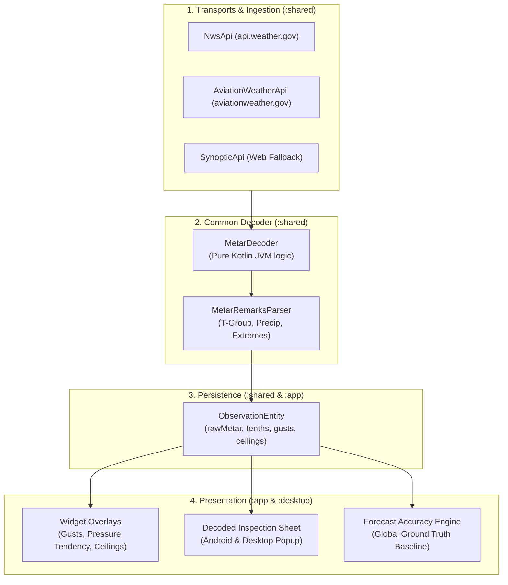

# Incorporating METAR Data into the Weather Widget — Brainstorm

**Date:** 2026-08-23  
**Status:** Brainstorm & Architecture Options  
**Target Modules:** `:shared` (decoding, blending, fetching), `:app` (Android widget, sheets), `:desktop` (popup, tray)  

---

## 1. Executive Summary & Core Value Proposition

While weather models (like Open-Meteo, Silurian, and NWP grids) provide continuous regional forecasts, they lack direct physical sensor observations. METAR (Aviation Routine Weather Report) represents the global standard for surface weather observations at thousands of airports worldwide.

Incorporating full-spectrum METAR data into the Weather Widget unlocks five major capabilities:
1. **Universal Ground Truth Across All APIs**: Provides a real-world "Actuals" observation baseline for non-NWS sources (Open-Meteo, Silurian) and for international locations outside the US.
2. **Sub-Degree Precision & Official Extremes**: Decodes remarks (the `T-group` for 0.1 °C precision, plus 6-hour and 24-hour official high/low extreme groups) to eliminate quantization rounding noise in accuracy calculations.
3. **Rich Widget Micro-Overlays**: Adds aviation-grade insights—such as true cloud base altitudes (ceilings), wind gusts, barometric pressure tendencies, and flight rules (VFR/IFR).
4. **Rapid Change "Shock Absorption" via SPECI**: Leverages unscheduled special reports issued immediately when thunderstorms, wind shifts, or precipitation start.
5. **Enthusiast "Decoded Station" Inspection**: Offers an interactive tap-to-inspect view displaying decoded airport sensor telemetry alongside the raw METAR string.

---

## 2. METAR in the Current Codebase

Currently, METAR data is partially consumed in the application:
- `NwsApi`: Pulls observations via `api.weather.gov/stations/{id}/observations` (which packages ASOS/AWOS METARs into JSON).
- `SynopticApi`: Pulls web fallback observations (`metar_set_1`).
- `MetarRawSkyParser`: Decodes only sky cover layers (`FEW`, `SCT`, `BKN`, `OVC`) for the cloud graph.

**Current Limitation:** Full METAR reports are already being fetched, but valuable groups (precise temperatures, wind gusts, pressure tendencies, precipitation rates, and official max/min remarks) are discarded at ingest time.

---

## 3. Brainstormed Idea Clusters

### Cluster A: Precision & Extreme Enrichment (Zero New Network Calls)
*Harnessing data already present in existing NWS / Synoptic observation payloads.*

* **A1. Tenths-of-a-Degree Temperature & Dewpoint (`T-group`)**:
  * *Code:* `RMK ... T02000144` $\rightarrow$ 20.0 °C / 14.4 °C (68.0 °F / 57.9 °F).
  * *Impact:* Eliminates the $\pm 0.9\text{ }^\circ\text{F}$ rounding noise present in standard integer-rounded API payloads, dramatically improving accuracy calculation baselines.
* **A2. Official 6-Hour & 24-Hour Max/Min Temperature Remarks**:
  * *Code:* `1sTTTT` (6h Max), `2sTTTT` (6h Min), `4sTTTTsTTTT` (24h Max/Min).
  * *Impact:* Captures the official calendar-day extremes directly from the ASOS sensor rather than attempting to reconstruct extremes via interpolation.
* **A3. Measured Hourly & Multi-Hour Precipitation**:
  * *Code:* `Pxxxx` (hourly precip in hundredths of an inch), `6xxxx` (3/6-hr), `7xxxx` (24-hr).
  * *Impact:* Upgrades rain actuals from inferred/binary to exact physical accumulations.
* **A4. Raw METAR Column in Local DB**:
  * *Idea:* Store `rawMetar TEXT` in `ObservationEntity`.
  * *Benefit:* Makes historical observation records future-proof so new parser improvements can re-decode historical data without requiring schema migrations.

---

### Cluster B: Universal Ground Truth & Global Transports
*Providing physical actuals for all forecast sources (US and International).*

* **B1. Aviation Weather API (`aviationweather.gov/api/data/metar`)**:
  * Free, unauthenticated, multi-station endpoint with global coverage.
  * *Capability:* Allows batch-fetching all nearby airport stations (e.g., `ids=KSJC,KPAO,KNUQ`) in a single HTTP request with elevation and pre-decoded fields.
* **B2. Universal Observation Anchor for Model-Only Sources**:
  * When using Open-Meteo or Silurian, the widget can use the nearest METAR station to display true current temperature and track forecast accuracy worldwide.
* **B3. Elevation Lapse-Rate Corrections in IDW**:
  * METAR feeds include station elevation (`elev`). Inverse Distance Weighting (IDW) can apply a standard lapse-rate correction (~6.5 °C / 1,000 m) so higher-elevation stations don't skew sea-level temperature estimates.

---

### Cluster C: Widget UI Overlays & Glanceable Insights

* **C1. Cloud Base Altitude (Ceilings)**:
  * Display ceiling heights on the hourly graph or current conditions badge (e.g., `"Ceiling 1,500 ft"` or visual cloud layer stacks).
* **C2. Wind Vector & Gust Badge**:
  * Compact wind indicator showing direction and gusts (e.g., `↙ 14 mph (G24)`).
* **C3. Barometric Pressure Tendency Arrow**:
  * Utilizing METAR altimeter (`A2992`) and 3-hour pressure change remark (`5appp`) to render rising ($\nearrow$), falling ($\searrow$), or steady ($\rightarrow$) indicators for approaching weather fronts.
* **C4. Flight Rules / Drone Category Indicator**:
  * Optional subtle color-coded dot or pill (VFR = Green, MVFR = Blue, IFR = Red, LIFR = Magenta) based on ceiling and visibility thresholds.

---

### Cluster D: Rapid Change Alerts (SPECI Reports)

* **D1. Sudden Weather Shift Detection**:
  * Airports issue unscheduled `SPECI` reports when rapid, significant changes occur (sudden heavy rain, 15+ kt wind shift, rapid temperature drop, or visibility collapse).
* **D2. Screen-Unlock Rapid Ingestion**:
  * Lightweight check for new `SPECI` timestamps on screen unlock to immediately update the widget with sudden real-time events before standard periodic forecast syncs run.

---

### Cluster E: Interactive UI & Inspection Surfaces

* **E1. Decoded METAR Bottom Sheet (Android) / Popover (Desktop)**:
  * Tapping the current station badge opens a clean, human-readable inspection panel:
    * **Station Name & Distance** (e.g., *San Jose International Airport • 4.2 mi away*)
    * **Raw String** with syntax highlighting / breakdown
    * **Exact Temperature & Dew Point** ($62.1\text{ }^\circ\text{F}$ / $51.8\text{ }^\circ\text{F}$)
    * **Relative Humidity & Heat Index**
    * **Altimeter & Pressure Tendency**
    * **Visibility & Cloud Layers**
* **E2. Multi-Station Microclimate Comparator**:
  * A view showing the 3 nearest airport stations to visualize local microclimate gradients (e.g., marine layer coastal fog vs. inland heat).

---

## 4. Architectural & Implementation Strategy

### Key Engineering Principles
1. **METAR is a Transport, Not a WeatherSource**:
   * Keep `WeatherSource` focused on forecast providers; treat METAR as an observation transport layer.
2. **Pure-Function Decoder in `:shared`**:
   * Implement `MetarDecoder` as a pure, dependency-free Kotlin engine in `:shared` to ensure 100% testability with standard JUnit unit tests.
3. **Preserve ASOS 5-Minute Frequency**:
   * Standard METAR arrives hourly; do not replace high-frequency 5-minute ASOS observations where available. Blend METAR remarks for precision without sacrificing observation frequency.
4. **Dual-Platform Parity**:
   * Ensure decoded views, graph overlays, and settings are implemented across both Android (`:app`) and Desktop (`:desktop`).

---

## 5. Suggested Roadmap

* **Phase 1: Remark Decoding on Existing Feeds**
  * Implement `MetarRemarksParser` in `:shared` to extract the `T-group` (tenth-degree precision) and 6h/24h extreme groups from already-fetched raw strings.
  * Store `rawMetar` in `ObservationEntity`.
* **Phase 2: Global Ground Truth Transport (`aviationweather.gov`)**
  * Add lightweight multi-station client to `:shared`.
  * Enable actuals comparison and real-time station display for Open-Meteo, Silurian, and non-US locations.
* **Phase 3: Widget Micro-Overlays & Decoded Inspection UI**
  * Add wind gusts, barometric pressure arrows, and cloud ceilings to widget layouts.
  * Build the Decoded METAR bottom sheet on Android and popup tab on Desktop.
